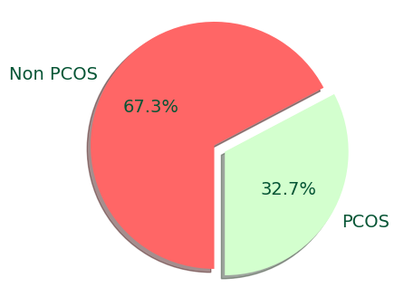

           
### BMI | Vücut Kitle İndeksi

### Blood Group | Kan grubu: 
 A+ = 11 
 A- = 12 
 B+ = 13
 B- = 14
 O+ = 15
 O- = 16
 AB+ = 17
 AB- = 18    

### Pulse rate(bpm) | Kalp atış hızı 

### RR (breaths/min) | Solunum hızı  

### Hb(g/dl) | Hemoglobin               
         

### Cycle length(days) | Menstrüal döngü uzunluğu       
         
         
### I beta-HCG(mIU/mL) | beta-HCG seviyesi 

_Source:_
> [1] https://americanpregnancy.org/getting-pregnant/hcg-levels/#:~:text=An%20hCG%20level%20of%20less,rise%20to%20confirm%20a%20pregnancy

### II beta-HCG(mIU/mL) | ?????? | 

### FSH(mIU/mL) | FSH seviyesi:               

### LH(mIU/mL) | LH seviyesi: 
Yumurtlamayı sağlayan hormondur.          

### FSH/LH | FSH/LH oranı                
              
       
### TSH (mIU/L) | Tiroit stimülan hormon  seviyesi          

### AMH(ng/mL) | Anti Müllerian Hormonu: yumurtalık rezervinin kalitesi             

### PRL(ng/mL) | Prolaktin hormon seviyesi               

### Vit D3 (ng/mL) | D vitamini seviyesi          

### PRG(ng/mL) | Progesteron seviyesi              

### RBS(mg/dl) | Rastgele bir zamanda kan şekeri              
        
      

### BP _Systolic (mmHg) | 120-129 mm Hg      

### BP _Diastolic (mmHg) | <80 mm Hg    

### Follicle No. (L) | Folikül sayısı (L)     

### Follicle No. (R) | Folikül sayısı (R)   

### Avg. F size (L) (mm) | Ortalama folikül boyutu (L)   

### Avg. F size (R) (mm) | Ortalama folikül boyutu (R)    

### Endometrium (mm) | Rahim kalınlığı         
