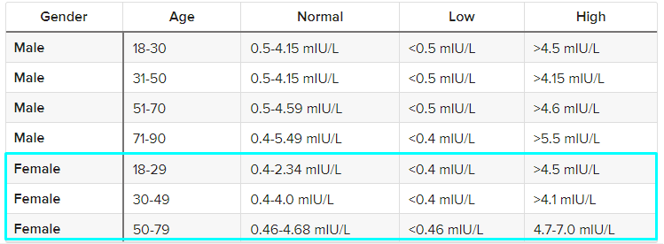

## BMI | Vücut Kitle İndeksi

> [1] https://www.cdc.gov/obesity/basics/adult-defining.html

## Blood Group | Kan grubu: 
 A+ = 11 
 A- = 12 
 B+ = 13
 B- = 14
 O+ = 15
 O- = 16
 AB+ = 17
 AB- = 18    

## Pulse rate(bpm) | Kalp atış hızı 

> [2] https://www.heartfoundation.org.nz/wellbeing/managing-risk/how-to-check-your-pulse-heart-rate

## RR (breaths/min) | Solunum hızı  

> [3] https://my.clevelandclinic.org/health/articles/10881-vital-signs

### Hb(g/dl) | Hemoglobin

> [4] https://www.mayoclinic.org/tests-procedures/hemoglobin-test/about/pac-20385075#:~:text=For%20men%2C%2013.2%20to%2016.6,to%2015%20grams%20per%20deciliter               
         
## Cycle length(days) | Menstrüal döngü uzunluğu       
       

> [5] https://www.cdc.gov/ncbddd/blooddisorders/women/menorrhagia.html#:~:text=Finding%20out%20if%20a%20woman,(2%20to%203%20tablespoons).
         
## I beta-HCG(mIU/mL) & II beta-HCG(mIU/mL)

_Source:_
> [1] https://americanpregnancy.org/getting-pregnant/hcg-levels/#:~:text=An%20hCG%20level%20of%20less,rise%20to%20confirm%20a%20pregnancy

## FSH(mIU/mL) | FSH seviyesi:               

> [] https://www.mountsinai.org/health-library/tests/follicle-stimulating-hormone-fsh-blood-test

## LH(mIU/mL) | LH seviyesi: 
Yumurtlamayı sağlayan hormondur.  

> [] https://www.urmc.rochester.edu/encyclopedia/content.aspx?ContentTypeID=167&ContentID=luteinizing_hormone_blood
       
## TSH (mIU/L) | Tiroit stimülan hormon  seviyesi          

> [ ] https://www.healthline.com/health/optimal-thyroid-levels#tsh-range-chart

## AMH(ng/mL) | Anti Müllerian Hormonu:
AMH seviyeleri yaşınıza bağlı olarak değişir. Kadınlarda AMH seviyeleri ergenlik döneminde yükselmeye başlar ve 25 yaş civarında zirveye ulaşır. Bundan sonra AMH seviyeleri doğal olarak düşüyor.
 
> [] https://my.clevelandclinic.org/health/diagnostics/22681-anti-mullerian-hormone-test

yumurtalık rezervinin kalitesi 
Burda PCOS mu AMH değerlerine göre bak   

> [] https://advancedfertility.com/infertility-testing/amh-fertility-testing/

## PRL(ng/mL) | Prolaktin hormon seviyesi               

> [ ] https://www.ucsfhealth.org/medical-tests/prolactin-blood-test#:~:text=The%20normal%20values%20for%20prolactin,80%20to%20400%20%C2%B5g%2FL)

## Vit D3 (ng/mL) | D vitamini seviyesi
  
> [ ] https://www.medicalnewstoday.com/articles/normal-vitamin-d-levels#function        

## PRG(ng/mL) | Progesteron seviyesi              

> [] https://www.urmc.rochester.edu/encyclopedia/content.aspx?ContentTypeID=167&ContentID=progesterone

## RBS(mg/dl) | Rastgele bir zamanda kan şekeri              

> [] https://www.orangehealth.in/rbs-test?utm_source=seo_search&utm_medium=google&utm_campaign=seo&utm_term=rbs-test
      
## BP _Systolic (mmHg) & BP _Diastolic (mmHg)

> [] https://www.cdc.gov/bloodpressure/about.htm

## Follicle No. (L) & Follicle No. (R)   

> [] https://www.fertilityfamily.co.uk/blog/how-many-eggs-per-follicle-everything-you-need-to-know/#:~:text=The%20number%20of%20antral%20follicles,reserve%20is%20greater%20than%2012.

## Avg. F size (L) (mm) & Avg. F size (R) (mm)  

> [] https://www.institutobernabeu.com/en/blog/what-are-follicles-number-growth-and-other-characteristics/
 
## Endometrium (mm) | Rahim kalınlığı         

> https://radiopaedia.org/articles/endometrial-thickness