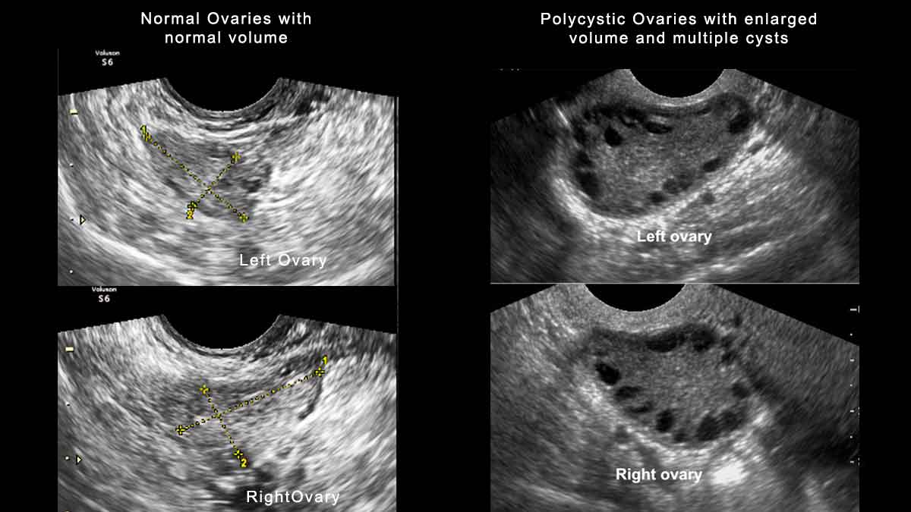

# Polikistik Over Sendromu Tahmini (PCOS)
**Polikistik over sendromu**,  kadınlarda en sık görülen hormonal bozuklukların başında yer almaktadır. PCOS, üreme çağındaki kadınların tahmini olarak %8-13'ünü etkilemektedir. Dünya çapında etkilenen kadınların %70'e kadarı teşhis edilememektedir. Anovülasyonun ve kısırlığın önde gelen nedenidir.

Polikistik over sendromunun belirtileri kişiden kişiye farklılık gösterebilir. Görülen semptomlar zamanla değişebilir.

Görülebilecek olası semptomlar:
- _Düzensiz menstrüal döngü dönemler_
- _Kısırlık_
- _Sivilce veya yağlı cilt_
- _Yüzde veya vücutta aşırı kıllanma_
- _Saç dökülmesi veya saç incelmesi_
- _Özellikle göbek çevresinde kilo alımı_

PCOS'lu kişilerin aşağıdakiler de dahil olmak üzere başka sağlık sorunlarına sahip olma olasılığı daha yüksektir:
- _Tip 2 diyabet_
- _Hipertansiyon_ 
- _Yüksek kolesterol_
- _Kalp hastalığı_
- _Endometrial kanser_ 
PKOS ayrıca kaygıya, depresyona ve anksiyete gibi psikolojik sorunlara da neden olabilmektedir. 

Aşağıdakilerden en az ikisinin varlığı ile polikistik over sendromu tanısı konur:
- _Yüksek androjen belirtileri veya semptomları (istenmeyen yüz veya vücut kılları, saçların dökülmesi, sivilce, kanda yüksek testosteron seviyesi)_
- _Düzensiz regl dönemleri olması veya regl dönemlerinin olmaması_
- _Ultrason taramasında polikistik yumurta görüntüsü_

Ayrıca ultrason görüntüsü her zaman net olmayabilir ve PKOS'lu bazı kadınların ultrason taraması polikistik yumurtalıkları göstermeyebilir.

> !! PCOS'un nedeni bilinmemektedir ancak aile öyküsü veya tip 2 diyabeti olan kadınlar daha yüksek risk altındadır.

PCOS kronik bir durumdur ve belirli bir tedavisi yoktur. Ancak bazı semptomlar yaşam tarzı değişiklikleri, ilaçlar ve doğurganlık tedavileri yoluyla iyileştirilebilir. 

Sağlıklı bir diyet uygulamak ve yeterli egzersiz yapmak, kilo vermeye ve Tip 2 diyabet riskinin azalmasına yardımcı olabilir. 
Doğum kontrol ilaçları (doğum kontrol hapı) adet döngüsünü düzenlemeye ve semptomları azaltmaya yardımcı olabilir.
 

## Veri Seti
Bu çalışma için kullanılan açık kaynaklı Polikistik Over Sendromu verileri Kaggle’dan alındı.​

Veri Seti: [PCOS Dataset](https://www.kaggle.com/datasets/shreyasvedpathak/pcos-dataset)
* 541 satır​
* 45 sütun​

Veri setindeki her satır bir hastayı temsil eder, her sütun ise hastalara ait özelliklerini içerir.
 

 |**ÖZELLİK NO**|**ÖZELLİK**|**AÇIKLAMA**|
 |---|---|---|
 0   |Sl. No | Seri Numarası  
 1   |Patient File No. | Hasta dosya numarası 
 2   |PCOS (Y/N) | PCOS sendromunun olup olmaması
 3   |Age (yrs) | Yaş    
 4   |Weight (Kg) | Kilo      
 5   |Height(Cm) | Boy              
 6   |BMI | Vücut Kitle İndeksi                   
 7   |Blood Group | Kan grubu: A+=11, A-=12, B+=13, B-=14, O+=15, O-=16, AB+=17, AB-=18           
 8   |Pulse rate(bpm) | Kalp atış hızı         
 9   |RR (breaths/min) | Solunum hızı    
 10  |Hb(g/dl) | Hemoglobin                
 11  |Cycle(R/I) | Regl döngüsünün düzenli olup olmadığı          
 12  |Cycle length(days) | Menstrüal döngü uzunluğu       
 13  |Marriage Status (Yrs) | Yıl cinsinden evlilik durumu
 14  |Pregnant(Y/N) | Hamile olup olmadığı            
 15  |No. of abortions | Kürtaj sayısı         
 16  |I beta-HCG(mIU/mL) | Beta-HCG seviyesi  
 17  |II beta-HCG(mIU/mL) | -  
 18  |FSH(mIU/mL) | FSH seviyesi              
 19  |LH(mIU/mL) | LH seviyesi               
 20  |FSH/LH | FSH/LH oranı                   
 21  |Hip(inch) | Kalça                 
 22  |Waist(inch) | Bel                
 23  |Waist:Hip Ratio | Bel/Kalça oranı         
 24  |TSH (mIU/L) | Tiroit Stimülan Hormon            
 25  |AMH(ng/mL) | Anti Müllerian Hormonu
 26  |PRL(ng/mL) | Prolaktin Hormonu               
 27  |Vit D3 (ng/mL) | D Vitamini seviyesi         
 28  |PRG(ng/mL) | Progesteron Hormonu              
 29  |RBS(mg/dl) | Rastgele bir zamanda kan şekeri seviyesi                
 30  |Weight gain(Y/N) | Kilo alımı        
 31  |hair growth(Y/N) | Saç uzaması        
 32  |Skin darkening (Y/N) | Cilt kararması
 33  |Hair loss(Y/N) | Saç kaybı          
 34  |Pimples(Y/N) | Sivilce            
 35  |Fast food (Y/N) | Fast Food tüketilip tüketilmediği         
 36  |Reg.Exercise(Y/N) | Düzenli egzersiz yapılıp yapılmadığı      
 37  |BP _Systolic (mmHg) | 120-129 mm Hg      
 38  |BP _Diastolic (mmHg) | <80 mm Hg    
 39  |Follicle No. (L) | Folikül sayısı-Sol      
 40  |Follicle No. (R) | Folikül sayısı-Sağ   
 41  |Avg. F size (L) (mm) | Ortalama folikül boyutu-Sol   
 42  |Avg. F size (R) (mm) | Ortalama folikül boyutu-Sağ    
 43  |Endometrium (mm) | Rahim kalınlığı         
 44  |Unnamed: 44 | İsimsiz sütun
